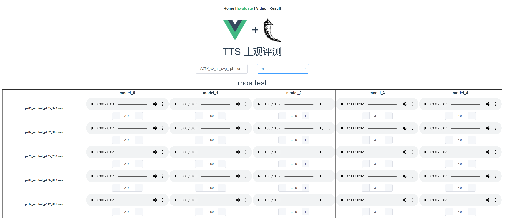
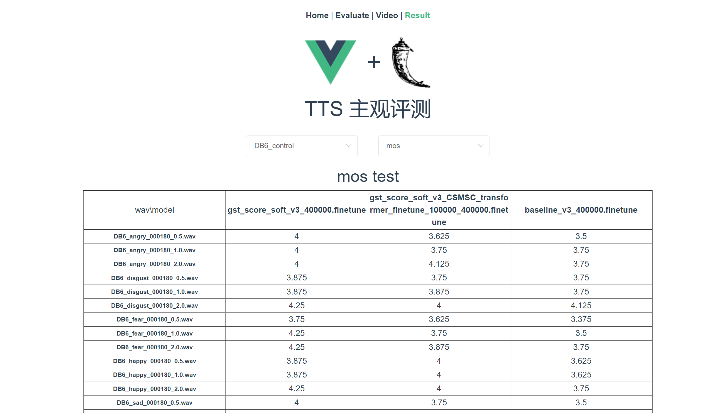

# SubjectiveTest 🌶️✌

基于 `vue` 和 `Flask` 的语音或视频主观评测网站。

### 简单手册

#### 安装

* Clone this repository:

	```
	$ git clone https://github.com/gtalarico/flask-vuejs-template.git
	```

* 设置环境，并使用 `pipenv` 启动进入虚拟环境:

	```
	$ pipenv install --dev
	$ pipenv shell
	```

* 安装 `js` 依赖

	```
	$ yarn install
	```
#### 运行方式

* 开发模式：

    ```
    $ yarn serve
    $ python run.py
    ```

    需要同时开启这两个命令，`vue` 的服务器在 `:8080` 端口，Flask API端口在 `:9020` 端口，可以进行热开发

* 部署模式：    

     ```
    $ yarn build
    $ python run.py
    ```
    
    `yarn build` 会生成生成静态文件到 `/dist/` 文件夹下，Flask 服务会发送静态文件，只需要最后启动一个 Flask 服务器

* 更改端口：

    `vue.config.js` 和 `run.py` 这两个文件夹决定了API的端口

### DEMO

* 评测页面

<p align="center">
    
</p>

* 结果页面

<p align="center">
    
</p>


#### 重要文件

| Location             |  Content                                   |
|----------------------|--------------------------------------------|
| `/app`               | Flask Application                          |
| `/app/api`           | Flask Rest Api (`/api`)                    |
| `/app/client.py`     | Flask Client (`/`)                         |
| `/app/resource.py`   | 主要的API文件，接收、发送数据                   |
| `/src`               | Vue App .                                  |
| `/src/views/`        | 主要页面，包括Evaluate、Video和Result         |
| `/src/main.js`       | JS Application Entry Point                 |
| `/public/index.html` | Html Application Entry Point (`/`)         |
| `/public/static`     | Static Assets                              |
| `/dist/`             | Bundled Assets Output (generated at `yarn build` |

## 待改进

- 页面使用 `bootstrap` 的`container-fluid`，太丑了

- `app/api/resource.py` 文件寻址规则写的太丑，最好根据api直接返回文件


